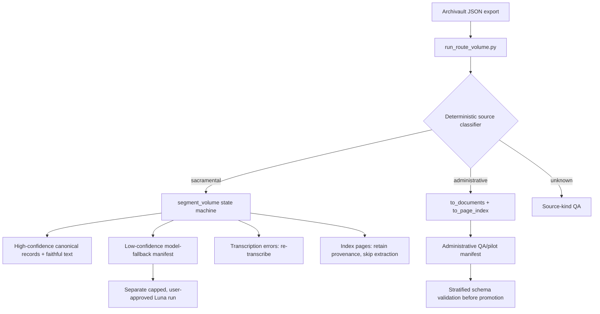

# SSDA NLP tools — Claude handoff (2026-07-22)

This repository is the working copy for an SSDA historical-register pipeline.
The immediate production problem is to process heterogeneous Archivault
transcription exports accurately, cheaply, and with auditable provenance.

**Do not expose, print, commit, or persist API keys.** Credentials are supplied
outside the repository and must be process-scoped for a single approved call.
No paid request is authorized merely because a script exists.

## Current decision summary

- Use **GPT-5.6 Luna** as the current sacramental extraction cost/quality
  choice. Terra is a quality challenger, not the selected production default.
- Keep **faithful source text and source-image provenance** alongside any
  normalized/model-derived data. Do not replace or discard faithful text.
- Use deterministic processing first. Models are an explicit, capped fallback
  only; the router never makes network calls or selects its own spend.
- Do not use the sacramental entry splitter for administrative dossiers.
- Do not request more manual segmentation examples right now. The five
  available fixture pairs cover 47 records and pass; request more only for a
  new genre/layout/language/failure mode.

## Data inventory

The connected Drive folder has six relevant volume exports. Byte-identical local
copies already exist under `C:\Users\mahajar\Downloads\sample images\_task2\drive_ready\`
for every volume except 3952, which is local at `drive_pilots/3952.json`.

| Volume | Actual material | Exported pages | Handling |
|---|---|---:|---|
| 29597 | Havana marriage register | 521 | sacramental |
| 176899 | Cienfuegos baptism/marriage register | 495 | sacramental |
| 3952 | Cofradía administrative dossiers | 27 (25 substantive) | administrative |
| 375062 | Limonar baptism/pastoral register | 466 | sacramental |
| 201991 | Guanabacoa burial/parish register | 779 | sacramental |
| 701054 | Portuguese burial register | 105 | sacramental; 54 table/index pages |

The actual Drive listing is documented in
[`eval_data/drive_volume_inventory_20260721.md`](eval_data/drive_volume_inventory_20260721.md).
Do not infer genre from how many images belong to a top-level JSON item:
701054 is one 105-page item but is a register; 3952 is multiple administrative
dossiers.

## Architecture



### Router and deterministic paths

New/updated implementation:

- `ssda_nlp_tools/routing.py` — conservative source-kind inference and
  per-page routing manifest. It uses title, corpus genre cues, page shape,
  index/error detection, and deterministic segmentation confidence. Ambiguous
  inputs route to QA rather than guessing.
- `run_route_volume.py INPUT --out MANIFEST.json --source-kind auto` — local,
  no-network CLI. `--source-kind sacramental|administrative` is an explicit
  operator override.
- `ssda_nlp_tools/admin_records.py` — deterministic administrative dossier
  preparation. `to_documents()` removes only synthetic `START`/`END` markers;
  `to_page_index()` preserves each page's faithful text/image and exposes
  clearly labeled regex name/date *candidates* (not asserted entities).
- `run_admin_pilot.py INPUT --out DOSSIERS.json --page-index-out INDEX.json` —
  creates the administrative local artifacts.
- Existing `ssda_nlp_tools/segment.py` and `run_segment.py` remain the
  sacramental state-machine segmenter. Do not change them to chase
  normalization differences in manual gold.

### Full local routing sweep (already run)

Per-page manifests are ignored local artifacts under
`drive_pilots/routing_manifests/`. The summary is committed in
[`eval_data/drive_routing_sweep_20260722.md`](eval_data/drive_routing_sweep_20260722.md).

| Route | Count | Meaning |
|---|---:|---|
| deterministic sacramental | 2,192 | run locally; no provider spend |
| Luna sacramental fallback candidate | 101 | do **not** send until separately approved/capped |
| re-transcribe | 16 | upstream transcription failure; do not extract |
| skip index | 57 | retain provenance but no record extraction |
| administrative QA/pilot | 25 | not production-approved |

Two synthetic 3952 export markers are deterministically omitted, so 2,393
exported pages become 2,391 routed units.

## Manual segmentation gold

Fixture pairs live in `tests/fixtures/` and are covered by
`tests/test_segment.py`:

| Fixture | Records | Coverage |
|---|---:|---|
| 65858 | 10 | Portuguese boundaries |
| 420550 | 8 | Colombian Spanish formula |
| 260950 | 13 | Portuguese 1910 baptisms |
| 544367 | 5 | trailing partial record retained |
| 740018 | 11 | `demil` year form + cross-page stitching |

Current result: **47/47 gold records located**. The manual gold sometimes
normalizes/corrects source transcription; score it as segmentation/boundary
recall, not literal text equality. Relevant reports:

- `eval_data/manual_gold_regression_20260722.md`
- `eval_data/breaking_examples_20260720.md`
- `eval_data/task3_segmentation.md`

## Model evidence and selection

All model scores below are agreement against existing GPT-4o-generated
references, not independent human truth. Long text comparisons must use
`difflib.SequenceMatcher(..., autojunk=False)`.

Cross-volume core F1 over 88 reference entries (San Agustín Spanish only):

| Model | People | Events | Relationships | Coverage |
|---|---:|---:|---:|---:|
| GPT-5.6 Luna | 0.973 | 0.971 | **0.829** | 86/88 |
| GPT-5.4 mini | 0.923 | 0.979 | 0.738 | 87/88 |
| Claude Haiku 4.5 | 0.947 | **1.000** | 0.757 | 88/88 |

Complete 32-entry head-to-head:

| Model | People F1 | Events F1 | Relationships F1 | Normalized mean | Measured 32-entry cost |
|---|---:|---:|---:|---:|---:|
| GPT-5.6 Luna | 0.9890 | 0.9620 | 0.8360 | **0.9842** | lower; selected |
| GPT-5.6 Terra | **0.9917** | **1.0000** | **0.8435** | 0.9793 | $0.405045 |

Details and caveats:

- `eval_data/entity_f1_bakeoff.md`
- `eval_data/new_candidate_bakeoff_20260721.md`
- `eval_data/llm_model_research.md`

## Administrative 3952 pilot: do not blindly retry

3952 is Spanish colonial cofradía/administrative material. It needs a schema
for organizations, people/offices, places, dates, actions and uncertainty, not
the sacramental people/events/relationships schema.

`run_admin_luna_pilot.py` is dry-run by default. It supports page chunking,
`--profile full|compact-index`, `--reasoning-effort none`, explicit document
selection/skips, a hard cap, separate `confirmed_usd`/`reserved_usd`, JSON and
stop-reason validation, and immediate stop on invalid/truncated output.

Observed paid behavior under the approved $0.25 administrative cap:

| Attempt | Outcome | Cost |
|---|---|---:|
| doc-002 whole dossier | valid JSON | $0.027876 |
| doc-003 whole dossier | 5,000-token truncation | $0.036106 |
| doc-003 pages 1–4 | 2,000-token truncation | $0.013914 |
| doc-003 pages 1–2, no reasoning | valid JSON | $0.011270 |
| doc-003 pages 3–4, no reasoning | 1,800-token truncation | $0.012136 |
| doc-003 page 3, no reasoning | 700-token truncation | $0.005248 |

Administrative confirmed spend is **$0.106550**, with **$0 reserved** and
**$0.143450 remaining** within that cap. The compact index profile is built but
is deliberately marked QA/pilot-only: it has not completed stratified human
validation. Do not send more administrative text without a revised narrow
schema/dry-run and explicit user approval.

See `eval_data/administrative_pilot_3952.md` for the detailed record.

## Paid-run safety rules

1. Dry-run first; show worst-case *new* spend and cumulative ledger total.
2. Require explicit user approval after the dry-run for every changed paid plan.
3. Use hard cap flags and process-scoped credentials only. Never print keys,
   read them into a committed artifact, or upload them to Drive.
4. Validate JSON, requested IDs/counts, stop reason, usage tokens and cost
   after each request. Stop on truncation, invalid JSON or ambiguous error.
5. Retain `reserved_usd` on network/5xx/interruption; release only definitive
   unbilled 4xx reservations.
6. Do not call provider APIs just because a fallback manifest exists.

Existing untracked scripts `run_sonnet_cached_batch.py`,
`submit_gemini_batch.py`, and `submit_sonnet_batch.py` predate this work and
must remain untouched unless explicitly reviewed.

## Useful commands

Use the bundled interpreter if `python` is not on PATH:

```powershell
$py = 'C:\Users\mahajar\.cache\codex-runtimes\codex-primary-runtime\dependencies\python\python.exe'

# Free routing manifest for one export
& $py run_route_volume.py INPUT.json --source-kind auto --out routing_manifest.json

# Existing sacramental segmenter
& $py run_segment.py INPUT.json --out segmented.json --structural

# Administrative local prep only
& $py run_admin_pilot.py INPUT.json --out dossiers.json --page-index-out page_index.json

# Administrative Luna preparation only; stays dry-run without --confirm
& $py run_admin_luna_pilot.py dossiers.json --profile compact-index --max-output-tokens 400 --max-usd 0.25
```

Focused tests can be invoked by importing their test functions because this
runtime does not have `pytest` installed. At minimum run `compileall` and the
relevant `tests/test_routing.py`, `tests/test_admin_records.py`,
`tests/test_admin_luna_pilot.py`, and `tests/test_segment.py` functions.

## Recent commits

| Commit | Purpose |
|---|---|
| `c091425` | all-volume Drive routing validation + report |
| `b50b68d` | manual-gold regression sweep report |
| `f5f3474` | Drive-calibrated genre/table routing correction |
| `207854d` | deterministic heterogeneous-volume router + ADR |
| `ea10e41` | administrative page index + compact profile |
| `7a7d908`–`20ad776` | capped Luna administrative pilot and audited outcomes |
| `70011d9` | complete Terra reference coverage |

## Recommended next actions

1. Treat the 2,192 deterministic sacramental pages as the free production
   backlog; execute/validate their local segmented outputs with provenance.
2. Decide whether to approve a **new**, separately capped Luna run for a
   stratified subset of the 101 sacramental fallback pages. Do not lump them
   with administrative material.
3. Re-transcribe the 16 source-error pages upstream.
4. Before any further 3952 spend, define a minimal administrative index schema
   that fits an observed page response budget and validate it on a small,
   representative human-reviewed sample.
5. If new manual examples arrive, add the input/output pair to
   `tests/fixtures/`, add a regression test that measures boundary behavior,
   and update the manual-gold report. Do not change the segmenter merely to
   match manual normalization edits.
